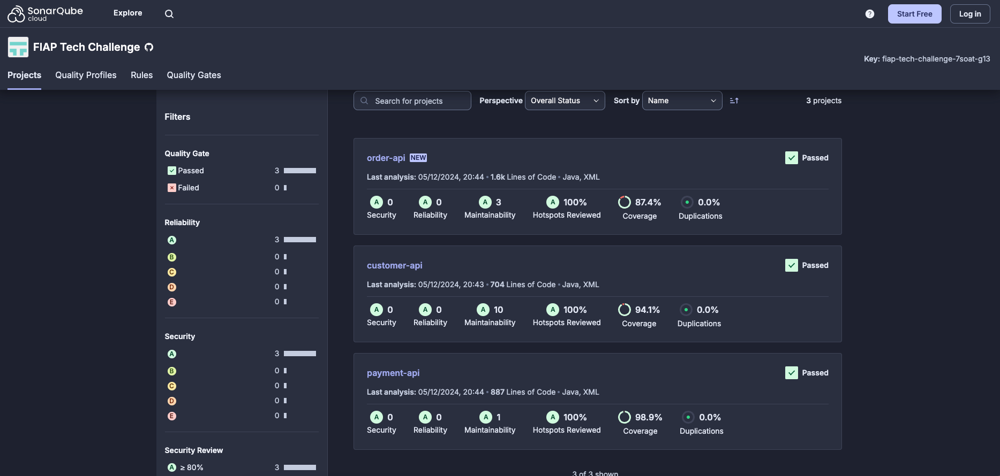

# FIAP Tech Challenge | Pós Tech

## Propósito desse projeto
Sistema para gestão de clientes.

## Stack utilizada
* MongoDB
* Java
* Docker
* Kubernetes
* Helm
* K6

## Pré-requisitos
* Ter o Docker instalado para criação e execução das imagens

## Documentação da API REST
Com a aplicação em execução, a documentação da API REST pode ser acessada através da URL: http://localhost:8080/swagger-ui/index.html

## Execução local pelo Docker
Para realizar o build e iniciar a aplicação basta executar o comando abaixo na raiz do projeto:
```bash
docker-compose up
```

## Execução local pelo Minikube
1. Instale o Minikube em sua máquina, seguindo as instruções do site oficial: https://minikube.sigs.k8s.io/docs/start
2. Inicie o Minikube:
```bash
minikube start
```
3. Habilite o metric-server no Minikube, para que o autoscale possa funcionar corretamente:
```bash
minikube addons enable metrics-server
```
4. Instale o Helm, seguindo as instruções do site oficial: https://helm.sh/docs/intro/install/

5. Dentro do diretório do projeto, execute o comando passando o diretório `k8s` como parâmetro, assim todos os arquivos dentro dele serão aplicados no Kubernetes:
```bash
kubectl apply -f k8s
```
6. Descubra o IP do Minikube, que precisamos para acessar a aplicação:
```bash
minikube ip
```
7. Se tudo ocorrer normalmente, a aplicação já poderá ser acessada através do IP exibido, na porta 30000.
8. Instale o K6, seguindo as instruções do site oficial: https://grafana.com/docs/k6/latest/set-up/install-k6/
9. Execute o teste de carga na aplicação e será possível observar o autoscale em ação:
```bash
# - O IP utilizado no comando deve ser o IP do Minikube, obtido através dos comandos anteriores.
# - Os parâmetros 'vus' e 'duration' podem ser ajustados de acordo com a carga desejada no teste.
k6 run -e HOSTNAME=192.168.49.2:30000 --vus 100 --duration 30s script.js
```

## Passos para testar API
Abaixo os passos necessários para simular a criação de customer no sistema. Os comandos estão utilizando o endereço IP do Minikube 192.168.49.2. Esse IP poderá ser diferente na sua máquina e talvez seja necessário substituí-lo, conforme explicamos na seção [Execução local pelo Minikube](#execução-local-pelo-minikube).

1. Cadastrar cliente
```
curl --location 'http://192.168.49.2:30000' \
--header 'Content-Type: application/json' \
--data-raw '{
  "name": "Bill Gates",
  "email": "bill.gates@microsoft.com",
  "document": "44867508020",
  "password": "abc1@XYZ"
}'
```

## Cobertura de código do sistema

Pode ser analisado melhor a cobertura no seguinte link: https://sonarcloud.io/project/overview?id=fiap-tech-challenge-7soat-g13_customer-api



Existem outros endpoints no sistema, como alteração e exclusão de produto, listagem de clientes, etc. Para visualização completa sugerimos a acessar o Swagger ou a utilização da collection do Postman.
## Autores
* Cristiano de Barros
* Graziela Göedert de Souza
